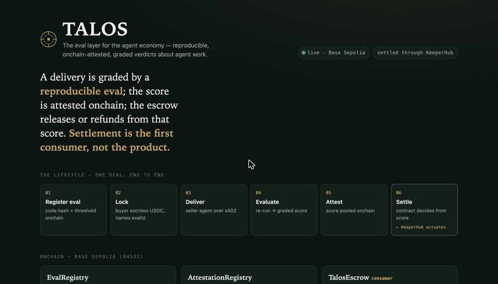

# Talos — The Eval Layer for the Agent Economy

> The bronze automaton that circled Crete, weighing every visitor and enforcing the law with no
> human hand. Talos is the same idea for the agent economy: a machine that grades agent work and
> settles funds on its own — releasing when the work is *provably* correct, refunding when it
> isn't, and never asking a human to press "pay."

**Talos is a registry of reproducible evals that emit onchain-attested, graded verdicts about
agent work.** An agent's deliverable is graded by a registered evaluator; the verdict (a **score**
+ independently-checkable evidence) is posted onchain as an **attestation**. Any consumer — an
escrow, a marketplace, a reputation reader — acts on the attestation. **Settlement is the first
consumer, not the product.**

Built for the KeeperHub **"Agents Onchain"** hackathon (DoraHacks).



> The console (`web/dashboard.html`) makes the whole eval → attest → settle flow legible at a
> glance: score-vs-threshold meters, the 90% < 95% graded-refund money shot, and every settle
> linking to basescan.

---

## The one-liner that survives a hostile judge

> *"What stops the seller from fooling the evaluator?"*

Nothing, if grading is an LLM plausibility check — an adversarial seller games it. So Talos grades
only the **decidable class**: an eval is registered only when its verdict is **reproducible**. A
verdict cites `evalId + version`; anyone resolves the registered `evaluatorCodeHash`, re-runs the
evaluator on the same `inputHash`, and **must reproduce the score**. Correctness becomes a *pure
function of the input* — and **reproducibility becomes an onchain property**, not a vibe.

Graded, not just pass/fail: a `fieldMatch` eval scores a delivery by the fraction of fields that
reproduce. A 97%-correct delivery clears a 95% bar and releases; a 90%-correct one fails and
refunds — **decided by the contract from the onchain score**.

## Three onchain objects, clean separation

| Object | What it is | Where |
|---|---|---|
| **EvalRegistry** | Catalogue of reproducible evals: name/version, `evaluatorCodeHash`, `threshold` (bp), trust tier. | `contracts/src/EvalRegistry.sol` |
| **AttestationRegistry** | Onchain graded verdicts: `attest(evalId, deliverableHash, inputHash, score, evidenceHash)`. Reputation reads off `Attested` events. | `contracts/src/AttestationRegistry.sol` |
| **TalosEscrow** (a *consumer*) | A deal names an `evalId`. `settle(dealId, attId)` reads the attestation and — from the **onchain score vs the onchain threshold** — releases to the seller or refunds the buyer. | `contracts/src/TalosEscrow.sol` |

The release condition is onchain-checkable (attestation exists + `evalId` matches + `score ≥
threshold`), not a keeper's bare bool. **The contract picks the branch, not the keeper.**

## Where KeeperHub fits (thinks vs acts, honestly)

The graded verdict is computed off-chain (reproducibility can't be onchain), so KeeperHub
**actuates a proven verdict**: a webhook workflow signs `settle(dealId, attId)`. The **deadline
refund is genuinely autonomous** — a KeeperHub Block-Interval workflow reads `isExpired(dealId)`
from onchain state and refunds with *zero keeper input*. That autonomous branch is the honest
centerpiece of "KeeperHub acts."

## Run it (zero credentials)

Requires [Foundry](https://getfoundry.sh) (`anvil`, `forge`) and Node ≥ 20 + `pnpm`.

```bash
cd keeper && pnpm install && cd ..
./run.sh
```

`run.sh` spins a local `anvil`, deploys the eval-layer stack + a `MockUSDC` faucet, starts the
**seller as its own agent process**, and runs the full lifecycle — **every leg a real onchain tx**:

- `reproduction`, full-correct → score **10000** → **release**
- `fieldMatch`, 97% correct → score **9700 ≥ 9500** → **release** (graded pass)
- `fieldMatch`, 90% correct → score **9000 < 9500** → **refund** (graded fail — the money shot)
- `reproduction`, tampered → score **0** → **refund** (fraud)
- expiry, no delivery → **autonomous** block-interval refund

```
━━ Balances ━━
  buyer  Δ -20.40 USDC
  seller Δ 20.40 USDC   (2 releases = 20 USDC + 5 x402 delivery fees = 0.50 USDC)
━━ Reputation (from onchain Attested events) ━━
  0x3C44…  4 attestations · mean score 71.8% · 2/4 passed
```

Inspect the trail (eval → score → attestation → settle tx → outcome):

```bash
cd keeper && pnpm audit          # or: pnpm deals  ·  npx tsx src/cli.ts reputation
```

## Tests

```bash
cd contracts && forge test        # 40: registries, score-gated settle, graded pass/fail, fuzz, EIP-3009
cd keeper    && pnpm test         # 9: each evaluator scores correctly AND reproducibly
```

## The eval lifecycle

```
┌──────────────┐  x402 request/pay   ┌──────────────┐
│ Buyer agent  │────────────────────▶│ Seller agent │  (separate process, x402 HTTP endpoint)
└──────┬───────┘  deliver + input-ref └──────┬───────┘
       │ lock(dealId, …, evalId)              │ delivery
       ▼                                      ▼
┌──────────────────────┐          ┌────────────────────────────┐
│ EvalRegistry         │          │  Keeper / evaluator SDK     │
│ AttestationRegistry  │◀─ attest─│  evaluate() → graded Verdict │
│ TalosEscrow (consumer)│  (score) │  (reproduction/fieldMatch/…) │
└──────────┬───────────┘          └──────┬──────────────────────┘
           │ settle(dealId, attId)        │ POST {dealId, attId}
           │  score ≥ threshold ? release ▼
           │                     ┌────────────────────────────┐
           └─────────────────────│ KeeperHub workflow          │
             Web3 Action signs   │ webhook → settle(dealId,attId)│
             settle() / refund()  │ block-interval → refund()    │
                                  └────────────┬────────────────┘
                                               ▼  onchain USDC settlement
```

## Evaluators shipped (v1, all `reproducible`)

| id | Score | Reproducible because |
|---|---|---|
| `reproduction` | binary 10000/0 — re-run the agreed transform, byte-compare the output hash | output is a pure function of input |
| `fieldMatch` | **graded** — fraction of fields that reproduce (97/100 → 9700) | each field re-derived independently |
| `signature` | binary — payload signed by a named oracle key (ECDSA verify) | signature verification is deterministic |

The `trustTier` enum reserves `Attested` and `Judged` (LLM/rubric) tiers for later, clearly
labeled lower-trust; v1 registers only `Reproducible`.

## Onboarding — zero to a live settlement

Onboarding a KeeperHub agent has real friction (toolchain, funding, deploy, eval registration,
wiring the workflow, the first settlement — and the `kh_` vs `wfb_` webhook-key trap). `talos
onboard` walks every prerequisite as a self-healing checklist and prints the **exact next action**
where something's missing:

```bash
cd keeper && pnpm onboard
```

```
  TALOS · onboard   zero to a live onchain settlement
  ✓  Node ≥ 20
  ✓  Foundry (forge/anvil)
  ✓  RPC reachable            http://127.0.0.1:8545 · chain 31337
  ✓  Contracts deployed       escrow 0x…
  ✓  Evals registered onchain 3 evals live
  ◦  KeeperHub workflow wired  using settler-fallback actuator
  ✓  First settlement landed  5 settlements in the audit trail
  All green. Open the console: web/dashboard.html
```

Then the **console** (`web/dashboard.html`) — a self-contained, zero-dependency page — turns the
onchain state into something a newcomer understands in 30 seconds.

## Deploy to Base Sepolia

See **[`TESTNET.md`](./TESTNET.md)** — real Circle USDC, settlement fired through real KeeperHub
workflows (`settle(dealId, attId)` webhook + autonomous block-interval refund). Live results with
onchain tx links: **[`docs/keeperhub-testnet-results.md`](./docs/keeperhub-testnet-results.md)**.

## Layout

```
contracts/        Foundry: EvalRegistry, AttestationRegistry, TalosEscrow (consumer), MockUSDC, tests
keeper/src/
  evaluators/     the Evaluator SDK — reproduction, fieldMatch (graded), signature, registry
  attest.ts       register evals onchain · evaluate → attest → attId
  keeperhub.ts    actuation: settle(dealId, attId) via workflow webhook · settler-fallback
  watcher.ts      idempotent settle-intent loop + autonomous deadline refund
  agents/         buyer (lock with evalId), seller (standalone x402 delivery, per-eval modes)
  adapters/       x402 delivery adapter (EIP-3009 auth, settled onchain — real USDC moves)
  demo.ts         the end-to-end run   ·   cli.ts   audit / deals / reputation views
docs/superpowers/specs/  the eval-layer design spec
run.sh            one-command demo (two agent processes)
```

## Scope

**Shipped:** EvalRegistry + AttestationRegistry + score-gated escrow onchain; evaluator SDK with a
graded evaluator; register→lock→x402→evaluate→attest→settle lifecycle; autonomous deadline refund;
reputation from `Attested` events; two-agent-process demo; live fraud/graded-fail refunds; KeeperHub
actuation. **Out of scope (schema leaves room):** `Attested`/`Judged` trust tiers, evaluator
staking/slashing, sandboxed `testExec` evaluator, EAS mirror, deliverable-hash re-delivery nonce.
```
